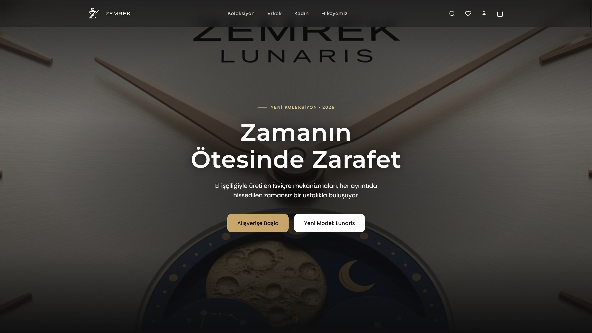
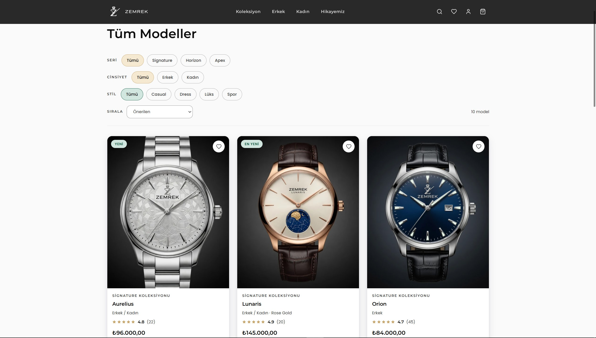
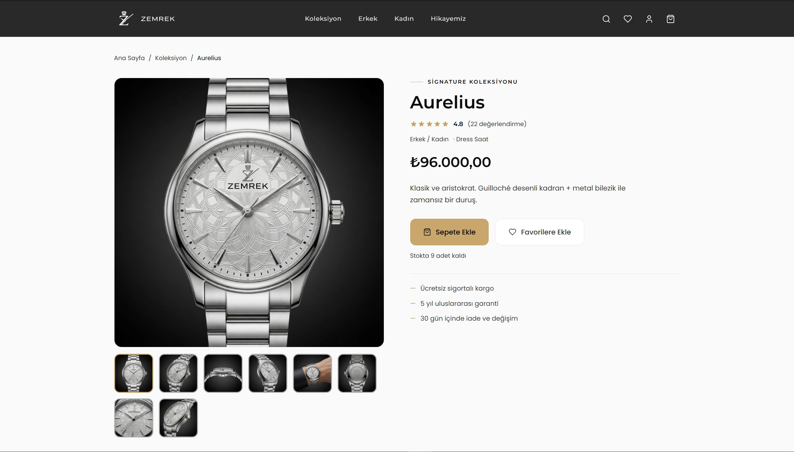
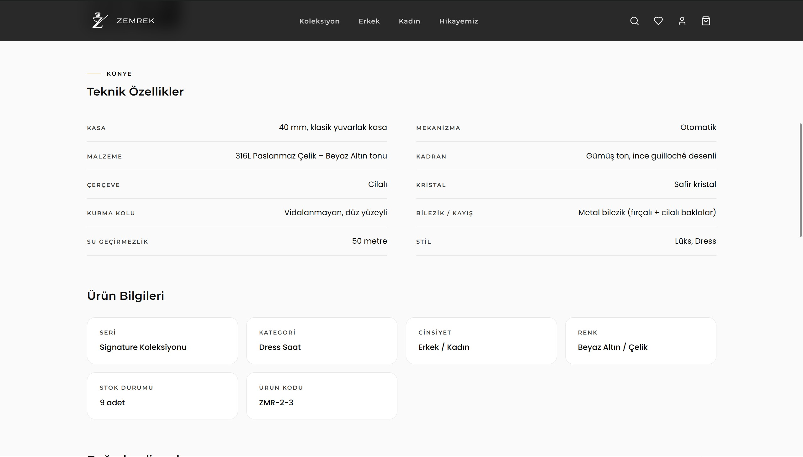
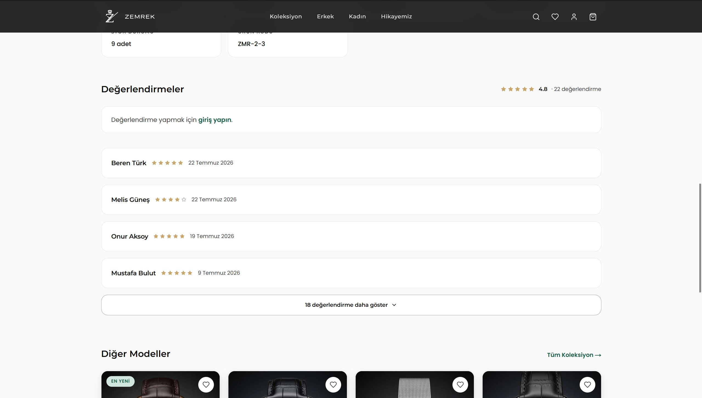
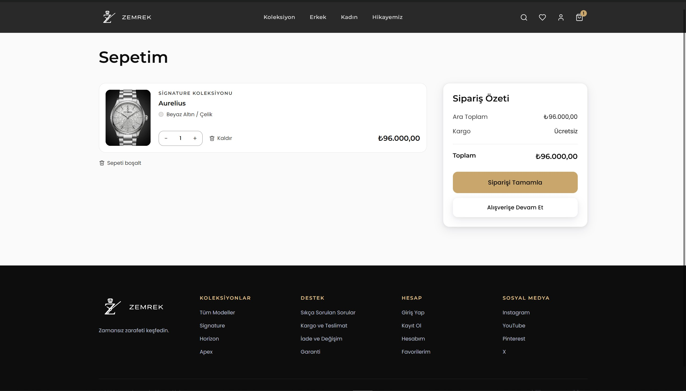
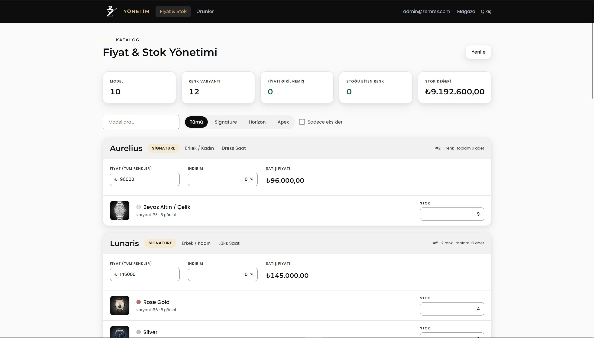
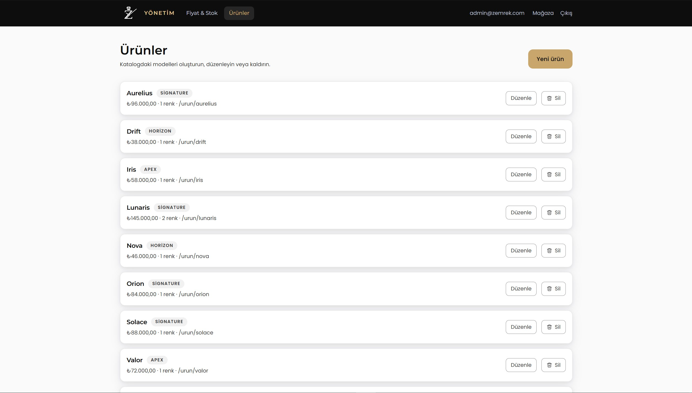
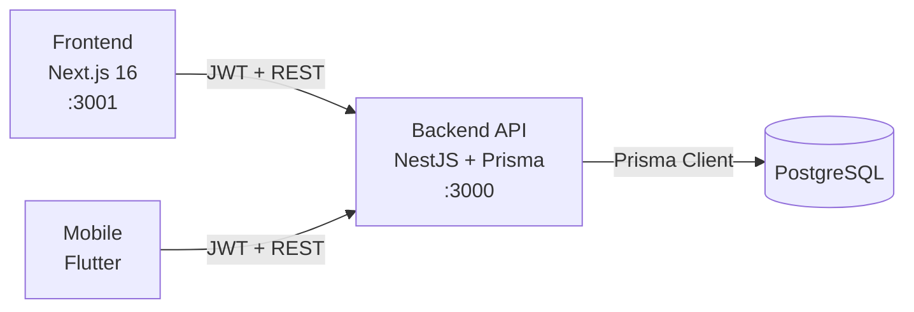

<div align="center">

# ⌚ Zemrek

### Saat markası için uçtan uca e-ticaret platformu — web, mobil ve API

VBT Staj 2026 E-Ticaret ödevi kapsamında geliştirilen **Zemrek**, renk varyantlı
ürün kataloğu, sepet/favori/değerlendirme akışları ve admin yönetim paneli
içeren gerçek bir e-ticaret deneyimidir. Tek bir NestJS API'yi Next.js web
arayüzü ve Flutter mobil uygulaması paylaşır.


[Özellikler](#-özellikler) · [Vitrin](#-vitrin) · [Mimari](#-mimari) · [Bileşen Rehberleri](#-bileşen-rehberleri) · [Hızlı Başlangıç](#-hızlı-başlangıç) · [API](#-api-ve-yetkilendirme) · [Demo](#-demo) · [Testler](#-testler) · [Ekip](#-ekip)

</div>

---

## ✨ Özellikler

| Alan | Yetenekler |
|---|---|
| **Vitrin** | Hero + Lunaris kaydırma sekansı, öne çıkan/yeni gelen ürünler, seri ve marka hikayesi sayfaları |
| **Katalog** | Seri / cinsiyet / stil filtreleri, arama, sıralama, renk varyantlı ürün detayı (galeri + fiyat + stok birlikte değişir), teknik künye |
| **Alışveriş** | Varyant bazlı sepet (misafirken tarayıcıda, girişte sunucuda — hesaba girişte otomatik birleşir), favoriler, adresten seçmeli ödeme akışı |
| **Değerlendirmeler** | Ürün başına tek puanlı değerlendirme, yorum opsiyonel, ürün kartlarında ortalama puan |
| **Hesap** | Kayıt, giriş, JWT (access + refresh), profil, adres yönetimi |
| **Admin** | Fiyat/stok/indirim düzenleme ve ürün CRUD'u — sadece `ADMIN` rolüne açık, panelin tamamı rol korumalı |
| **Platform** | Swagger/OpenAPI dokümantasyonu, class-validator ile global doğrulama, tutarlı `400/404/409` hata yönetimi, Docker Compose ile tek komut kurulum |

### Neden varyant bazlı model

Aynı saat modelinin farklı renkleri ayrı `ProductVariant` kayıtlarıdır: her
varyantın kendi görselleri, stoğu ve indirim yüzdesi vardır, fiyat ise model
seviyesinde sabittir. Sepet ve favoriler ürüne değil **varyanta** bağlanır —
böylece aynı modelin iki rengi sepette iki ayrı satır olarak görünür ve stok
renk bazında doğru şekilde düşer.


## 🖼️ Vitrin

<table>
  <tr>
    <td width="50%" align="center"><strong>Ana sayfa</strong></td>
    <td width="50%" align="center"><strong>Koleksiyon</strong></td>
  </tr>
  <tr>
    <td></td>
    <td></td>
  </tr>
  <tr>
    <td width="50%" align="center"><strong>Ürün detayı</strong></td>
    <td width="50%" align="center"><strong>Teknik özellikler</strong></td>
  </tr>
  <tr>
    <td></td>
    <td></td>
  </tr>
  <tr>
    <td width="50%" align="center"><strong>Değerlendirmeler</strong></td>
    <td width="50%" align="center"><strong>Sepet</strong></td>
  </tr>
  <tr>
    <td></td>
    <td></td>
  </tr>
  <tr>
    <td width="50%" align="center"><strong>Admin — Fiyat & Stok</strong></td>
    <td width="50%" align="center"><strong>Admin — Ürünler</strong></td>
  </tr>
  <tr>
    <td></td>
    <td></td>
  </tr>
</table>


## 🏗️ Mimari



Tek kaynak-doğru backend: web ve mobil aynı REST API'ye karşı çalışır, mock
veri kullanılmaz. Panelden girilen fiyat/stok değişikliği her iki istemciye de
anında yansır.

### Teknoloji yığını

| Katman | Teknoloji |
|---|---|
| Backend | NestJS, Prisma (pg adapter), PostgreSQL, JWT (passport), class-validator, Swagger |
| Frontend | Next.js 16 (App Router), TypeScript, Tailwind CSS v4, TanStack Query, Zustand |
| Mobile | Flutter, Provider tarzı servis katmanı, `http`, `shared_preferences` |
| Test | Jest (backend unit), Playwright (frontend e2e) |
| Çalışma zamanı | Docker Compose |

## 📦 Bileşen Rehberleri

Her uygulama kendi kurulum, komut, mimari ve klasör yapısı detaylarıyla ayrıca
dokümante edilmiştir.

| Bileşen | Sorumluluk | Dokümantasyon |
|---|---|---|
|  | Auth, ürün/varyant, kategori, sepet, favoriler, değerlendirmeler, kullanıcı/adres API'leri | [backend/README.md](./backend/README.md) |
|  | Vitrin, koleksiyon, sepet/ödeme, hesap ve admin arayüzü | [frontend/README.md](./frontend/README.md) |
|  | Giriş/kayıt, ana sayfa, ürün detayı, değerlendirmeler, sepet, favoriler, hesap | [mobile/README.md](./mobile/README.md) |

## 🚀 Hızlı Başlangıç

### Ön koşullar

- Docker Desktop (backend için tek başına yeterli)
- Node.js 20+ (frontend için)
- Flutter SDK (mobil için)

### Backend

```bash
cd backend
cp .env.example .env
docker compose up --build
```

Bu komut PostgreSQL'i ayağa kaldırır, migration'ları uygular, örnek verileri
(idempotent — tekrar çalıştırmak veri kaybettirmez) yükler ve API'yi hot-reload
ile başlatır.

| Servis | Adres |
|---|---|
| API | http://localhost:3000 |
| Swagger UI | http://localhost:3000/api |
| PostgreSQL | `localhost:5432` (`postgres` / `postgres` / `ecommerce_db`) |

### Frontend

```bash
cd frontend
npm install
cp .env.example .env.local
npm run dev        # http://localhost:3001
```

Backend'in `http://localhost:3000`'de çalışıyor olması gerekir (adres
`.env.local`'dan değiştirilebilir).

### Mobile

```bash
cd mobile
flutter pub get
flutter run
```

`lib/core/api_config.dart` içindeki API adresinin çalışan backend'i göstermesi
gerekir (Android emülatöründe `localhost` yerine `10.0.2.2` kullanılmalıdır).

### Demo hesaplar

| Rol | E-posta | Şifre |
|---|---|---|
| Admin | `admin@zemrek.com` | `Admin123!` |

Seed, örnek kategoriler ve görselli ürünleri (renk varyantlarıyla birlikte)
otomatik yükler.

## 🔐 API ve Yetkilendirme

Tam Swagger dokümantasyonu backend ayaktayken
[http://localhost:3000/api](http://localhost:3000/api) adresinde.

| Modül | Uç noktalar |
|---|---|
| **Auth** | `POST /auth/register` · `POST /auth/login` · `POST /auth/refresh` |
| **Users** | `GET/PATCH /users/profile` · `PATCH /users/change-password` · `POST /users/addresses` · `DELETE /users/addresses/:id` |
| **Categories** | `GET/POST /categories` · `GET/PATCH/DELETE /categories/:id` |
| **Products** | `GET/POST /products` (arama, `gender`, `categoryId`, fiyat aralığı, sıralama, sayfalama) · `GET/PATCH/DELETE /products/:id` · `PATCH /products/variants/:variantId` (fiyat/stok/indirim, sadece **ADMIN**) |
| **Cart** | `GET /cart` · `POST /cart/items` · `PATCH/DELETE /cart/items/:variantId` · `DELETE /cart` |
| **Favorites** | `GET/POST /favorites` · `DELETE /favorites/:variantId` |
| **Reviews** | `GET/POST /products/:productId/reviews` · `DELETE /reviews/:id` |

### Yetki modeli

- Kimlik doğrulama gerektiren uç noktalar JWT bearer token bekler.
- Admin uç noktaları ayrıca token içindeki `role` alanının `ADMIN` olmasını
  ister (`@Roles('ADMIN')` + `RolesGuard`); rol token'dan okunduğu için rol
  değişikliğinin etkili olması yeniden girişi gerektirir.
- Geçersiz/eksik veri `400`, bulunamayan kayıt `404`, çakışan kayıt (örn. aynı
  isimli kategori) `409` döner.

## 🗂️ Veri Modeli

- **Product** — model bazlı sabit fiyat, çoklu cinsiyet (`ERKEK`/`KADIN`), seri, stil etiketleri, teknik künye alanları (kasa, malzeme, mekanizma vb.), kategoriye bağlı.
- **ProductVariant** — rengin taşıdığı gerçek veri: `colorName`, `colorHex`, görseller, **stok** ve **indirim yüzdesi**.
- **User / Address** — kullanıcı profili ve kayıtlı teslimat adresleri.
- **Cart / CartItem** — varyant bazlı sepet satırları, stok kontrolü.
- **Favorite** — kullanıcı ↔ varyant, tekil kayıt.
- **Review** — ürün başına kullanıcı başına tek değerlendirme (1-5 puan, yorum opsiyonel).

Şemanın tamamı: [backend/prisma/schema.prisma](./backend/prisma/schema.prisma)

## 🎬 Demo

📹 Tanıtım videosu: _(link buraya eklenecek)_

## 🧪 Testler

| Paket | Kapsam | Komut |
|---|---|---|
| Backend | Auth ve users servis/controller birim testleri (Jest) | `cd backend && npm run test` |
| Frontend | 14 Playwright uçtan uca senaryo — vitrin/sepet/ödeme, hesap, değerlendirmeler, galeri, admin | `cd frontend && npm run test:e2e` |

Frontend e2e testleri gerçek backend'e karşı çalışır; çalıştırmadan önce
backend'in ayakta olması gerekir.

## 👥 Ekip

| İsim | Alan |
|---|---|
| Serdar Şahin | Backend |
| Berke Alacan | Backend |
| Ali Oğuz | Frontend |
| Dila Efendioğlu | Mobile |

## 🤝 Katkı Kuralları

- Her ekip yalnızca kendi klasörüne (`backend/`, `frontend/`, `mobile/`) dokunur.
- Değişiklikler `backend/*`, `frontend/*`, `mobile/*` önekli branch'lerden PR ile `main`'e alınır.
- Şema değişiklikleri (`schema.prisma`) tüm ekipleri etkilediği için PR açıklamasında belirtilmelidir.

## 🧰 Claude Code Skill'leri

Bu repoda, Claude Code (VSCode eklentisi) ile kullanılabilen paylaşımlı skill'ler var. Repoyu klonlayan herkes bunları kullanabilir.

| Skill | Ne yapar |
|---|---|
| `/api-test` | Çalışan backend API'sindeki tüm endpoint'leri otomatik keşfedip test eder, sonuçları (status kodu, dönen veri) tablo halinde raporlar. Body isteyen endpoint'lere uygun mock veri üretir. |
| `/gunluk-ozet` | O gün yapılan değişiklikleri, herkesin anlayabileceği sade bir özet olarak `docs/gunluk/YYYY-MM-DD.md` dosyasına yazar. |

**Kullanım:**
1. Projeyi VSCode'da aç.
2. Claude Code panelinde `/api-test` veya `/gunluk-ozet` yaz (ya da doğal dille "endpoint'leri test et", "günlük özet çıkar" de).
3. Skill görünmüyorsa yeni bir Claude oturumu aç veya `/reload-skills` çalıştır.

---

<div align="center">

**VBT Staj 2026** programı kapsamında geliştirilmiştir.

</div>
